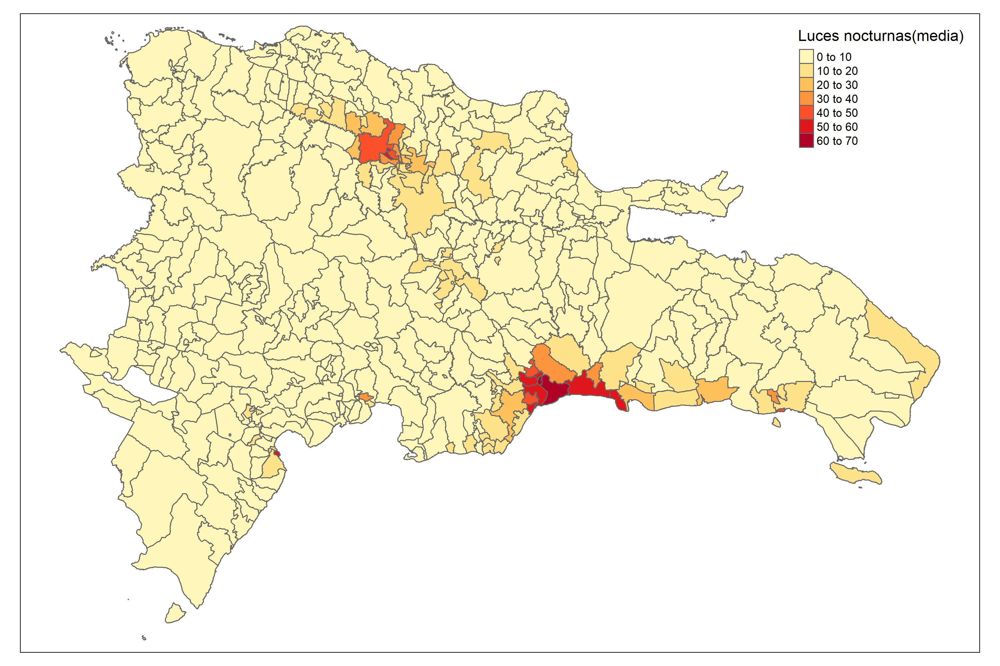

```{r setup, include=FALSE, message=FALSE, error=FALSE, warning=FALSE}
knitr::opts_chunk$set(
  echo = TRUE,
  message = FALSE,
  warning = FALSE,
  cache = TRUE,
  cache.path = "0Recursos/001/",
  fig.path = "0Recursos/001/"
)
library(printr)
library(kableExtra)
library(tidyverse)
library(magrittr)
library(rstan)
library(rstantools)
library(rstanarm)
tba <- function(dat, cap = NA){
  kable(dat,
      format = "html", digits =  4,
      caption = cap) %>% 
     kable_styling(bootstrap_options = "striped", full_width = F)%>%
         kable_classic(full_width = F, html_font = "Arial Narrow")
}
```

# Introducción. 

La técnica de estimación de áreas pequeñas conocida como Fay-Herriot, se basa en la combinación de información de una muestra de la población y de una fuente auxiliar, como las imágenes satelitales. Esta técnica se utiliza para mejorar la precisión de las estimaciones de áreas pequeñas, especialmente cuando la muestra de la población es limitada o no es representativa de la población completa.

Las imágenes satelitales pueden proporcionar información sobre características geográficas y ambientales de una zona, como la densidad de vegetación, el tipo de suelo, el uso del suelo, la topografía, entre otros. Esta información se puede utilizar para mejorar las estimaciones de las características de la población que se está estudiando.

La técnica Fay-Herriot es muy útil en áreas pequeñas donde la variabilidad de los datos es alta y la muestra es limitada. Las imágenes satelitales pueden ayudar a compensar la falta de información y proporcionar una fuente adicional de datos para mejorar las estimaciones.

# Librerias requeridas

Para realizar la descarga de imágenes satelitales, se debe surtir un proceso previo donde se enlazan, *R* - *Python* y  *Google Earth Engine*. Después de haber realizado la configuración requerida es posible realizar la descarga de información desde Google Earth Engine usando *R*. A continuación se listan las librerías necesaria para obtener la información.  

```{r}
rm(list = ls())      # Limpiar la memoria de R. 
memory.limit(50000)  # Aumentar los limites de la memoria de procesamiento
library(tidyverse)   # Procesamiento de bases de datos.
library(magrittr)
library(reticulate)  # Conexión con Python
library(rgee)        # Conexión con Google Earth Engine
library(sf)          # Paquete para manejar datos geográficos
library(tmap)
library(sp)
library(concaveman)  # Colapso de polígonos dentro de un archivo shapefile. 
library(geojsonio)   # Requerido por rgee 

```


# Inicializando Google Earth Engine desde R 
El proceso de la descarga de información de Google Earth Engine comienza con el  inicio de sesión en Google Earth Engine desde R, para ello se debe ejecutar el siguiente bloque de código, donde *"C://Users//sguerrero//Anaconda3//envs//rgee_py//python.exe"* debe ser sustituido por la ruta donde creo el espacio de trabajo para **Python**.  

```{r, eval=FALSE}
rgee_environment_dir = "C://Users//sguerrero//Anaconda3//envs//rgee_py//python.exe"
# Configurar python (Algunas veces no es detectado y se debe reiniciar R)
reticulate::use_python(rgee_environment_dir, required = T)
```

Al ejecutar la linea de código seleccione la opción *2*
```{r, eval=FALSE}
rgee::ee_install_set_pyenv(py_path = rgee_environment_dir, py_env = "rgee_py")
```

Por ultimo, inicialice Google Earth Engine
```{r, eval=FALSE}
Sys.setenv(RETICULATE_PYTHON = rgee_environment_dir)
Sys.setenv(EARTHENGINE_PYTHON = rgee_environment_dir)
rgee::ee_Initialize(drive = T)

```
si todo ha salido bien, debería ver un resultado como el que muestra a continuación. 

```{r echo=FALSE, out.width = "600px", out.height="150px",fig.align='center'}
knitr::include_graphics("www/Figura1_001.PNG")
```

# Descarga de información del Satélite a nivel distrito. 
Ahora se muestra el proceso de descarga de la información satélite a nivel de distrito, para ello es necesario contar con un archivo *Shapefile*. El shapefile es un formato de archivo utilizado para almacenar información geoespacial, que incluye datos de vectores como puntos, líneas y polígonos, junto con sus atributos asociados.

```{r, eval=FALSE}
# Lectura del shapefile de los distritos. 
poligonos_distrito <- read_sf( "shapefiles2010/DMCenso2010.shp")

# Extrayendo los parámetros de la imagen satelital. 
luces <- ee$ImageCollection("NOAA/DMSP-OLS/NIGHTTIME_LIGHTS") %>%
  ee$ImageCollection$filterDate("2013-01-01", "2014-01-01") %>%
  ee$ImageCollection$map(function(x) x$select("stable_lights")) %>%
  ee$ImageCollection$toBands()
```

Obteniendo la medida de resumen (media) de los pixeles de la imagen. El proceso se realiza distrito a distrito. La sintaxis que es utilizada corresponde a una mologación de código **Java** en **R**. 

**Nota:** Un píxel es un punto o un pequeño cuadrado que contiene información de color y brillo que se utiliza para representar una porción de la imagen.

```{r, eval=FALSE}
DOM_luces_distrito <- map(unique(poligonos_distrito$ENLACE),
                 ~tryCatch(
                   ee_extract(
                   x = luces,
                   y = poligonos_distrito["ENLACE"] %>% filter(ENLACE == .x),
                   ee$Reducer$mean(),
                   sf = FALSE
                 ) %>% mutate(ENLACE = .x),
                 error = function(e)data.frame(ENLACE = .x)))
```

Dado que la información fue extraída por separada para cada distrito. A continuación se muestra como se crea un 'data.frame' a partir de la lista 'DOM_luces_distrito'

```{r, eval=FALSE}
DOM_luces_distrito %<>% bind_rows()
```

Para obtener un mapa con los resultados obtenidos se ejecuta la sintaxis siguiente. 

```{r, eval=FALSE}
poligonos_distrito <- inner_join(poligonos_distrito, DOM_luces_distrito)

map_dist <- tm_shape(poligonos_distrito)

map_dist <-
  map_dist + tm_polygons(
    "F182013_stable_lights",
    title = "Luces nocturnas(media)",
    palette = "YlOrRd"
  )
tmap_save(map_dist,
          "map_temp/Luces nocturna distr.jpg",
          width = 3000,
          height = 2000,
          asp = 0
)

```

El mapa resultante se debe comparar con la información disponible en Google Earth Engine con el propósito de realizar una validación visual entre el imágen del satélite y la información descargada. 

```{r echo=FALSE, out.width = "800px", out.height="650px",fig.align='center'}

```

# Descarga de información Satélite a nivel municipal
El proceso de descarga de información satelital para el municipio sigue los mismos pasos, con pequeñas variaciones en la sintaxis acorde con la información satelital que se este obteniendo.  

## Luces nocturnas 
Para cada una de las variables satelitales se emplea como medida de resumen la media y la suma. 

Lectura de la shapefile del municipio. 
```{r}
poligonos_minucipio <- read_sf( "../shapefiles2010/MUNCenso2010.shp")
```


```{r, eval=FALSE}
luces <- ee$ImageCollection("NOAA/DMSP-OLS/NIGHTTIME_LIGHTS") %>%
  ee$ImageCollection$filterDate("2013-01-01", "2014-01-01") %>%
  ee$ImageCollection$map(function(x) x$select("stable_lights")) %>%
  ee$ImageCollection$toBands()
```

### Medida de resumen la media

```{r, eval=FALSE}
DOM_luces <- map(unique(poligonos_minucipio$ENLACE),
                 ~tryCatch(ee_extract(
                   x = luces,
                   y = poligonos_minucipio["ENLACE"] %>% filter(ENLACE == .x),
                   ee$Reducer$mean(),
                   sf = FALSE
                 ) %>% mutate(ENLACE = .x),
                 error = function(e)data.frame(ENLACE = .x)))

DOM_luces %<>% bind_rows() %>% 
  saveRDS("map_temp/data/temp_luces_mean.rds")
```

### Medida de resumen suma 
```{r,eval=FALSE}
DOM_luces <- map(unique(poligonos_minucipio$ENLACE),
                 ~tryCatch(ee_extract(
                   x = luces,
                   y = poligonos_minucipio["ENLACE"] %>% filter(ENLACE == .x),
                   ee$Reducer$sum(),
                   sf = FALSE
                 ) %>% mutate(ENLACE = .x),
                 error = function(e)data.frame(ENLACE = .x)))

DOM_luces %<>% bind_rows() %>% 
  saveRDS("map_temp/data/temp_luces_sum.rds")

```


## Cubrimiento urbano y cubrimiento cultivos

```{r,eval=FALSE}
tiposuelo = ee$ImageCollection("COPERNICUS/Landcover/100m/Proba-V-C3/Global") %>%
  ee$ImageCollection$filterDate("2016-01-01", "2016-12-31") %>%
  ee$ImageCollection$map(function(x) x$select("urban-coverfraction", "crops-coverfraction")) %>% 
  ee$ImageCollection$toBands()
```

### Medida de resumen la media

```{r, eval=FALSE}
DOM_suelo <- map(unique(poligonos_minucipio$ENLACE),
                 ~tryCatch(ee_extract(
                   x = tiposuelo,
                   y = poligonos_minucipio["ENLACE"] %>% 
                     filter(ENLACE == .x),
                   ee$Reducer$mean(),
                   sf = FALSE
                 ) %>% mutate(ENLACE = .x),
                 error = function(e)data.frame(ENLACE = .x)))

DOM_suelo %>% bind_rows() %>% 
  saveRDS("map_temp/data/temp_suelo_mean.rds")
```

### Medida de resumen suma 
```{r,eval=FALSE}
DOM_suelo <- map(unique(poligonos_minucipio$ENLACE),
                 ~tryCatch(ee_extract(
                   x = tiposuelo,
                   y = poligonos_minucipio["ENLACE"] %>% 
                     filter(ENLACE == .x),
                   ee$Reducer$sum(),
                   sf = FALSE
                 ) %>% mutate(ENLACE = .x),
                 error = function(e)data.frame(ENLACE = .x)))

DOM_suelo %>% bind_rows() %>% 
  saveRDS("map_temp/data/temp_suelo_suma.rds")

```


## Distancia a hospitales

```{r,eval=FALSE}
dist_salud = ee$Image('Oxford/MAP/accessibility_to_healthcare_2019') 
```

### Medida de resumen la media

```{r, eval=FALSE}
DOM_dist_salud <- map(unique(poligonos_minucipio$ENLACE),
                 ~tryCatch(ee_extract(
                   x = dist_salud,
                   y = poligonos_minucipio["ENLACE"] %>% filter(ENLACE == .x),
                   ee$Reducer$mean(),
                   sf = FALSE
                 ) %>% mutate(ENLACE = .x),
                 error = function(e)data.frame(ENLACE = .x)))

DOM_dist_salud %>% bind_rows() %>% 
  saveRDS("map_temp/data/temp_salud_mean.rds")
```

### Medida de resumen suma 
```{r,eval=FALSE}
DOM_dist_salud <- map(unique(poligonos_minucipio$ENLACE),
                      ~tryCatch(ee_extract(
                        x = dist_salud,
                        y = poligonos_minucipio["ENLACE"] %>% filter(ENLACE == .x),
                        ee$Reducer$sum(),
                        sf = FALSE
                      ) %>% mutate(ENLACE = .x),
                      error = function(e)data.frame(ENLACE = .x)))

DOM_dist_salud %>% bind_rows() %>% 
  saveRDS("map_temp/data/temp_salud_suma.rds")

```


## CSP gHM: Global Human Modification

```{r,eval=FALSE}
CSP_gHM = ee$ImageCollection('CSP/HM/GlobalHumanModification') 
```

### Medida de resumen la media

```{r, eval=FALSE}
DOM_CSP_gHM <- map(unique(poligonos_minucipio$ENLACE),
                      ~tryCatch(ee_extract(
                        x = CSP_gHM,
                        y = poligonos_minucipio["ENLACE"] %>% filter(ENLACE == .x),
                        ee$Reducer$mean(),
                        sf = FALSE
                      ) %>% mutate(ENLACE = .x),
                      error = function(e)data.frame(id_municipio = .x)))

DOM_CSP_gHM %>% bind_rows() %>% 
  saveRDS("map_temp/data/temp_gHM_mean.rds")
```

### Medida de resumen suma 
```{r,eval=FALSE}
DOM_CSP_gHM <- map(unique(poligonos_minucipio$ENLACE),
                   ~tryCatch(ee_extract(
                     x = CSP_gHM,
                     y = poligonos_minucipio["ENLACE"] %>% filter(ENLACE == .x),
                     ee$Reducer$sum(),
                     sf = FALSE
                   ) %>% mutate(ENLACE = .x),
                   error = function(e)data.frame(id_municipio = .x)))

DOM_CSP_gHM %>% bind_rows() %>% 
  saveRDS("map_temp/data/temp_gHM_suma.rds")

```

# Consolidando las variables satelitales
Ahora que toda las variables satelitales fueron descargadas y almacenadas en un archivo '.rds' se deben consolidar en un único archivo, para lo cual se utiliza el siguiente código. Además de renombrar las variables. 

### Medida de resumen la media
```{r}
satelital_promedio <- reduce(list(
readRDS("../map_temp/data/temp_gHM_mean.rds"),
readRDS("../map_temp/data/temp_salud_mean.rds"),
readRDS("../map_temp/data/temp_suelo_mean.rds"),
readRDS("../map_temp/data/temp_luces_mean.rds")), inner_join) %>% 
  rename(
    luces_nocturnas = F182013_stable_lights,
    cubrimiento_cultivo = X2016_crops.coverfraction,
    cubrimiento_urbano = X2016_urban.coverfraction,
    accesibilidad_hospitales = accessibility,
    accesibilidad_hosp_caminado = accessibility_walking_only,
    modificacion_humana = X2016_gHM)

tba(head(satelital_promedio, 15))
```

### Medida de resumen suma

```{r}
satelital_suma <- reduce(list(
  readRDS("../map_temp/data/temp_gHM_suma.rds"),
  readRDS("../map_temp/data/temp_salud_suma.rds"),
  readRDS("../map_temp/data/temp_suelo_suma.rds"),
  readRDS("../map_temp/data/temp_luces_sum.rds")), inner_join) %>% 
  rename(
    luces_nocturnas = F182013_stable_lights,
    cubrimiento_cultivo = X2016_crops.coverfraction,
    cubrimiento_urbano = X2016_urban.coverfraction,
    accesibilidad_hospitales = accessibility,
    accesibilidad_hosp_caminado = accessibility_walking_only,
    modificacion_humana = X2016_gHM)
tba(head(satelital_suma, 15))
```

Por último, se guarda el archivo que contiene las dos medidas de resumen en un nuevo '.rds'

```{r, eval=FALSE}
inner_join(
  satelital_promedio,
  satelital_suma,
  by = "ENLACE",
  suffix = c("_promedio", "_suma")
) %>%
  saveRDS("Data/auxiliar_satelital.Rds")

```

# Creando mapas de las variables satelitales

Como parte del proceso de validación se construyen los mapas de cada una variables y se deben comparar con la imagen disponible en *Google Earth Engine*. Ahora, se realiza la unión entre los polígonos (shapefile) y las 'data.frame' con las variables satelitales 

```{r}
poligonos_promedio <- read_sf( "../shapefiles2010/MUNCenso2010.shp")%>%
  dplyr::select(ENLACE) %>% inner_join(satelital_promedio) 

poligonos_suma <- read_sf( "../shapefiles2010/MUNCenso2010.shp") %>%
 dplyr::select(ENLACE) %>% inner_join(satelital_suma)
```

El siguiente paso es crear un objeto 'tamp', para crear los mapas. 

```{r}
m1 <- tm_shape(poligonos_suma)
m2 <- tm_shape(poligonos_promedio)
```

Ahora, se crean los mapas cara una de las variables. 

### Modificacion humana

```{r}
tmap_options(check.and.fix = TRUE)
m1_modificacion_humana<-
  m1 + tm_polygons(
    "modificacion_humana",
    title = "modificacion_humana(suma)",
    palette = "YlOrRd"
  )

m2_modificacion_humana <-
  m2 + tm_polygons(
    "modificacion_humana",
    title = "modificacion_humana(media)",
    palette = "YlOrRd"
  )

map_modificacion_humana <- tmap_arrange(list(m1_modificacion_humana,
                                             m2_modificacion_humana),
                                                ncol = 2,
                                                norw = 1)
map_modificacion_humana
```

Para guardar el mapa utilizamos la sintaxis. 

```{r,eval=FALSE}
tmap_save(map_modificacion_humana,
          "map_temp/modificacion_humana.jpg",
          width = 3000,
          height = 2000,
          asp = 0
)


```

## Accesibilidad hospitales caminado

```{r,eval=TRUE}
m1_accesibilidad_hosp_caminado<-
  m1 + tm_polygons(
    "accesibilidad_hosp_caminado",
    title = "accesibilidad_hosp_caminado(suma)",
    palette = "YlOrRd"
  )

m2_accesibilidad_hosp_caminado <-
  m2 + tm_polygons(
    "accesibilidad_hosp_caminado",
    title = "accesibilidad_hosp_caminado(media)",
    palette = "YlOrRd"
  )

map_accesibilidad_hosp_caminado <-
  tmap_arrange(
    list(
      m1_accesibilidad_hosp_caminado,
      m2_accesibilidad_hosp_caminado
    ),
    ncol = 2,
    norw = 1
  )
map_accesibilidad_hosp_caminado
```

Para guardar el mapa utilizamos la sintaxis. 

```{r,eval=FALSE}
tmap_save(map_accesibilidad_hosp_caminado,
          "map_temp/accesibilidad_hosp_caminado.jpg",
          width = 3000,
          height = 2000,
          asp = 0
)
```

## Accesibilidad hospitales

```{r,eval=TRUE}
m1_accesibilidad_hospitales <-
  m1 + tm_polygons(
    "accesibilidad_hospitales",
    title = "accesibilidad_hospitales(suma)",
    palette = "YlOrRd"
  )

m2_accesibilidad_hospitales <-
  m2 + tm_polygons(
    "accesibilidad_hospitales",
    title = "accesibilidad_hospitales(media)",
    palette = "YlOrRd"
  )


map_accesibilidad_hospitales <-
  tmap_arrange(
    list(m1_accesibilidad_hospitales,
         m2_accesibilidad_hospitales),
    ncol = 2,
    norw = 1
  )
map_accesibilidad_hospitales
```

Para guardar el mapa utilizamos la sintaxis. 

```{r,eval=FALSE}
tmap_save(map_accesibilidad_hospitales,
          "map_temp/accesibilidad_hospitales.jpg",
          width = 3000,
          height = 2000,
          asp = 0
)
```

## Cubrimiento urbano

```{r,eval=TRUE}
m1_cubrimiento_urbano <-
  m1 + tm_polygons(
    "cubrimiento_urbano",
    title = "cubrimiento_urbano(suma)",
    palette = "YlOrRd"
  )

m2_cubrimiento_urbano <-
  m2 + tm_polygons(
    "cubrimiento_urbano",
    title = "cubrimiento_urbano(media)",
    palette = "YlOrRd"
  )

map_cubrimiento_urbano <- tmap_arrange(
  list(m1_cubrimiento_urbano,
       m2_cubrimiento_urbano),
  ncol = 2,
  norw = 1
)
map_cubrimiento_urbano
```

Para guardar el mapa utilizamos la sintaxis. 

```{r,eval=FALSE}
tmap_save(map_cubrimiento_urbano,
          "map_temp/cubrimiento_urbano.jpg",
          width = 3000,
          height = 2000,
          asp = 0
)

```

## Cubrimiento cultivo

```{r,eval=TRUE}
m1_cubrimiento_cultivo <-
  m1 + tm_polygons(
    "cubrimiento_cultivo",
    title = "cubrimiento_cultivo(suma)",
    palette = "YlOrRd"
  )

m2_cubrimiento_cultivo <-
  m2 + tm_polygons(
    "cubrimiento_cultivo",
    title = "cubrimiento_cultivo(media)",
    palette = "YlOrRd"
  )

map_cubrimiento_cultivo <-
  tmap_arrange(
    list(m1_cubrimiento_cultivo, m2_cubrimiento_cultivo),
    ncol = 2,
    norw = 1
  )
map_cubrimiento_cultivo
```

Para guardar el mapa utilizamos la sintaxis. 

```{r,eval=FALSE}
tmap_save(map_cubrimiento_cultivo,
          "map_temp/cubrimiento_cultivo.jpg",
          width = 3000,
          height = 2000,
          asp = 0
)

```

## Luces nocturnas

```{r,eval=FALSE}
m1_luces <-
  m1 + tm_polygons(
    "luces_nocturnas",
    title = "luces_nocturnas(suma)",
    palette = "YlOrRd"
  )

m2_luces <-
  m2 + tm_polygons(
    "luces_nocturnas",
    title = "luces_nocturnas(media)",
    palette = "YlOrRd"
  )

map_luces <- tmap_arrange(list(m1_luces,m2_luces),
                          ncol = 2,
                          norw = 1)
map_luces
```

Para guardar el mapa utilizamos la sintaxis. 

```{r,eval=FALSE}
tmap_save(map_luces,
          "map_temp/luces.jpg",
          width = 6920,
          height = 4080,
          asp = 0
)

```

## Correlación estimación directa 

Crear una columnas para identificar los dominios en cada base. 

```{r}
satelital_suma %<>% mutate(
  id_dominio = substring(ENLACE, 3),
  id_dominio = str_pad(
    string = id_dominio,
    width = 4,
    pad = "0"
  )
)

satelital_promedio %<>% mutate(
  id_dominio = substring(ENLACE, 3),
  id_dominio = str_pad(
    string = id_dominio,
    width = 4,
    pad = "0"
  )
)
```

## Estimaciones directas 

Leer la base de datos con las estimaciones directas previamente calculadas. 

```{r}
estimacion_dir <- readRDS("../Data/base_FH.Rds") %>% 
  filter(!is.na(hat_var)) %>% 
  dplyr::select(id_dominio, Rd)

estimacion_dir_suma <- inner_join(estimacion_dir, satelital_suma)
estimacion_dir_promedio <- inner_join(estimacion_dir, satelital_promedio)
```

## Correlación de las variables satelital Vs estimación directa 

```{r}
cor_satelite <- rbind(
  cor(
    estimacion_dir_suma$Rd,
    estimacion_dir_suma %>%  dplyr::select(-ENLACE,-id_dominio, -Rd)
  ),
  cor(
    estimacion_dir_promedio$Rd,
    estimacion_dir_promedio %>%  dplyr::select(-ENLACE,-id_dominio, -Rd)
  )
)

rownames(cor_satelite) <- c("Suma", "Media")
t(cor_satelite) %>%tba()

```

# Información auxiliar en el modelo 
Creando mapas para las variables censales 

```{r,eval=FALSE}
auxiliar <- readRDS("../Data/auxiliar_org.Rds")  %>%
  dplyr::select(
    -F182013_stable_lights,-X2016_crops.coverfraction,
    -X2016_urban.coverfraction,-accessibility,
    -accessibility_walking_only,-ID_PROVINCIA
  ) %>%
  select_if(is.numeric) %>% 
  mutate(
   id_dominio = str_pad(
      string = id_municipio,
      width = 4,
      pad = "0"
    )
  )
```

Lectura del polígono 

```{r,eval=FALSE}
poligonos_auxiliar <-
  read_sf("../shapefiles2010/MUNCenso2010.shp") %>%
  mutate(
    id_dominio = substring(ENLACE, 3),
    id_dominio = str_pad(
      string = id_dominio,
      width = 4,
      pad = "0"
    )
  ) %>%
  dplyr::select(id_dominio, TOPONIMIA) %>%
  inner_join(auxiliar)
```

creando objeto de 'tmap'

```{r,eval=FALSE}
map_auxiliar <- tm_shape(poligonos_auxiliar)

for (ii in names(auxiliar)[-1]) {
  m1_auxiliar <-
    map_auxiliar + tm_polygons(ii,
                               title = ii,
                               palette = "YlOrRd")
  tmap_save(
    m1_auxiliar,
    paste0("../map_temp/", ii, ".jpg"),
    width = 3000,
    height = 2000,
    asp = 0
  )
  
}


```

